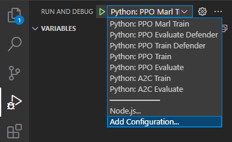
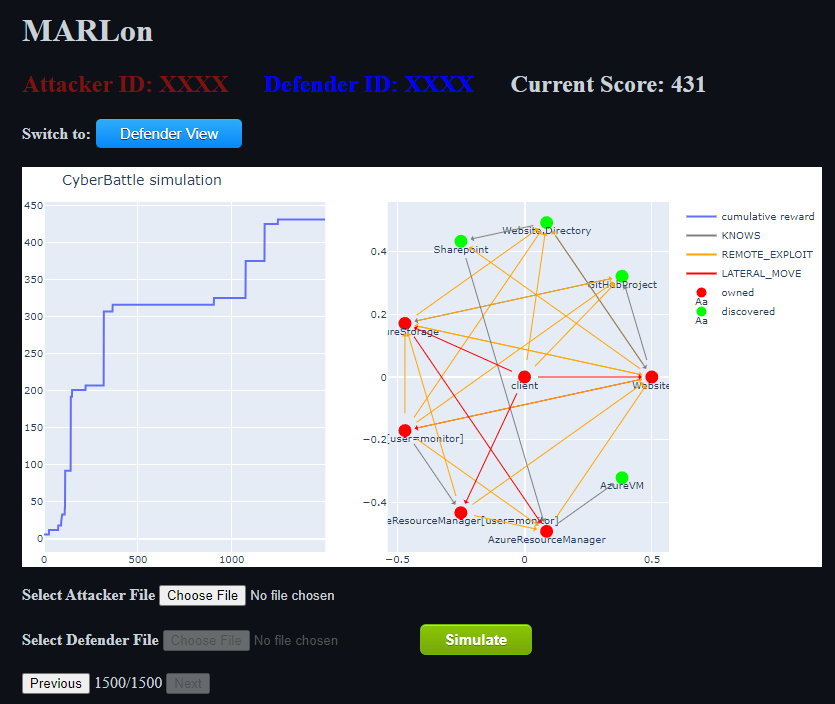

# MARLon

Using Multi-Agent Reinforcement Learning in [CyberBattleSim](https://github.com/microsoft/CyberBattleSim).

## Developing

### CyberBattleSim Image

CyberBattleSim cannot be installed using `pip install` like many other Python libraries, instead suggesting Docker as an installation method. In order to maintain a consistent development environment this repository uses VSCode Devcontainers powered by Docker. Unfortunately, CyberBattleSim does not provide a public image for licensing reasons so the CyberBattleSim Docker image must either be built manually or retrieved from a private Docker registry.

#### Building The CyberBattleSim Image

To build the CyberBattleSim Docker image, clone the official [CyberBattleSim](https://github.com/microsoft/CyberBattleSim) repository and run the following from the root directory:

```
docker build -t cyberbattle:1.1 .
```

Then in your cloned MARLon repository, change the first line of `.devcontainer/Dockerfile` from

```
FROM ghcr.io/james-lg/cyberbattlesim:1 as cb
```

to

```
FROM cyberbattle:1.1 as cb
```

## Running the Devcontainer

Open the cloned MARLon repository in VSCode and ensure the [Remote - Containers](https://marketplace.visualstudio.com/items?itemName=ms-vscode-remote.remote-containers) extension is installed.

Then click the 'Reopen in Container' button in the pop up in the bottom right. Or if that does not show up, click the green `><` icon in the very bottom left of VSCode, and select 'Reopen in Container' in the menu that opens from the center-top of VSCode.

You can now open a new terminal if one was not opened automatically with ``` Ctrl+Shift+` ```. 

# Usage

These subsections assume you are running the commands from a terminal within the Devcontainer. Instructions for opening the Devcontainer are given above.

## Training

Use the 'Run and Debug` tab of VSCode to choose a training script. Run the script by pressing the green play button to the left of the dropdown.



When the training has finished, the program will save the agent as a `.zip` or `.pkl` file in the current working directory before starting an multi-episode evaluation cycle.

## Simulating With a GUI

MARLon is capable of rerunning a saved agent for a single episode that can be viewed step-by-step using a GUI featuring the network graph.



### Running the GUI

The GUI is a locally hosted webapp to take advantage of CyberBattleSim's network graphs rendered with [plotly](https://plotly.com/javascript/). It can be run with the following command from the root of the repository.

```bash
flask run
```

Open [http://127.0.0.1:5000/](http://127.0.0.1:5000/) in a browser to access the page.

To exit the webapp, press `Ctrl+C` in the terminal running the webapp.

### Using the GUI

Choose an attacker and/or defender agent (a `.zip` or `.pkl` saved from training scripts described above), and press the Simulate button. Simulation make take several minutes to complete, check the webapp terminal output for progress.

The simulation has completed when the first graph renders. Use the Previous/Next buttons to move to the next step in which the reward value changed.